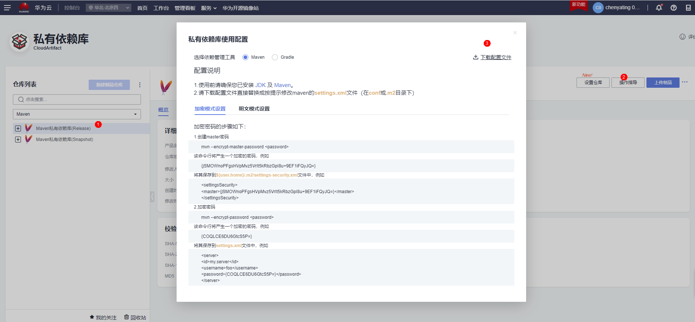

# Maven CloudArtifact Action

私有依赖库（[CloudArtifact](https://support.huaweicloud.com/cloudrelease/index.html)）用于管理私有组件（开发者通俗称之为私服），包括Maven、Npm、Go、PyPI、Rpm等多种仓库格式。  
Maven CloudArtifact Action会创建settings.xml文件(~/.m2/settings.xml),支持`<servers>`,`<mirrors>`,`<repositories>`和`<pluginRepositories>`，用户后续的步骤可以直接从私有依赖库上传下载依赖组件。

## **前置工作**
(1)[新建私有依赖库](https://support.huaweicloud.com/usermanual-releaseman/cloudrelease_01_0008.html)  
(2)[管理用户权限](https://support.huaweicloud.com/usermanual-releaseman/cloudrelease_01_0011.html)

## **参数说明**
私有依赖库CloudArtifact 参数获取来源：[私有依赖库首页](https://devcloud.cn-north-4.huaweicloud.com/cloudartifact/repository)->点击需要的Maven仓库->右上角操作指导->点击下载配置文件->Maven配置在下载的settings.xml文件当中  

### `servers`
json array of servers to add to settings.xml.  
```yml
steps:
- uses: huaweicloud/Maven-cloudartifact-action@v1.1.0
  with:
    servers: '[{"id": "serverId", "username": "${{ secrets.MAVEN_USERNAME }}", "password": "${{ secrets.MAVEN_PASSWORD }}"}]'
```
* 使用到账号密码等敏感信息，建议将参数内容设置在GITHUB的Settings->Secrets->Actions
Reference: [Maven Settings > Servers](http://maven.apache.org/settings.html#servers)
### `mirrors`
json array of mirrors to add to settings.xml.  
```yml
steps:
- uses: huaweicloud/Maven-cloudartifact-action@v1.1.0
  with:
     mirrors: '[{"id": "mirrorId", "mirrorOf": "mirrorOf", "url": "mirrorUrl"}]'
```
Reference: [Maven Settings > Mirrors](http://maven.apache.org/settings.html#mirrors)
### `repositories`
json array of repositories to add to settings.xml.  
```yml
steps:
- uses: huaweicloud/Maven-cloudartifact-action@v1.1.0
  with:
    repositories: '[{ "id": "some-repository", "url": "http://some.repository.url", "releases": { "enabled": "true" }, "snapshots": { "enabled": "false" } }]'
```
如果参数repositories为空或者不填，默认setting文件添加maven中心仓
```yaml
repositories: |
  [
    {
      "id": "central",
      "name": "Maven Central",
      "url": "https://repo1.maven.org/maven2",
      "releases": {
        "enabled": "true"
      },
      "snapshots": {
        "enabled": "false"
      }
    }
  ]
```

Reference: [Maven Settings > Repositories](http://maven.apache.org/settings.html#repositories)
### `pluginRepositories`
json array of pluginRepositories to add to settings.xml.  
```yml
steps:
- uses: huaweicloud/Maven-cloudartifact-action@v1.1.0
  with:
    plugin_repositories: '[{ "id": "some-plugin-repository", "url": "http://some.plugin.repository.url", "releases": { "enabled": "true" }, "snapshots": { "enabled": "false" }}]'
```
如果参数plugin_repositories为空或者不填，默认setting文件添加maven中心仓
```yaml
plugin_repositories: |
  [
    {
      "id": "central",
      "name": "Maven Central",
      "url": "https://repo1.maven.org/maven2",
      "releases": {
        "enabled": "true"
      },
      "snapshots": {
        "enabled": "false"
      }
    }
  ]
```
Reference: [Maven Settings > Plugin Repositories](http://maven.apache.org/settings.html#Plugin_Repositories)

## **使用样例**
### 1.默认不传参数样例
```yml
steps:
- uses: huaweicloud/Maven-cloudartifact-action@v1.1.0
```
settings.xml输出结果
```xml
<?xml version="1.0" encoding="UTF-8"?>
<settings xmlns="http://maven.apache.org/SETTINGS/1.0.0" xmlns:xsi="http://www.w3.org/2001/XMLSchema-instance" xsi:schemaLocation="http://maven.apache.org/SETTINGS/1.0.0 http://maven.apache.org/xsd/settings-1.0.0.xsd">
    <profiles>
        <profile>
            <id>
                CloudArtifactProfile
            </id>
            <repositories>
                <repositories>
                    <repository>
                        <id>
                            central
                        </id>
                        <name>
                            Maven Central
                        </name>
                        <url>
                            https://repo1.maven.org/maven2
                        </url>
                        <releases>
                            <enabled>
                                true
                            </enabled>
                        </releases>
                        <snapshots>
                            <enabled>
                                false
                            </enabled>
                        </snapshots>
                    </repository>
                </repositories>
            </repositories>
            <pluginRepositories>
                <pluginRepository>
                    <id>
                        central
                    </id>
                    <name>
                        Maven Central
                    </name>
                    <url>
                        https://repo1.maven.org/maven2
                    </url>
                    <releases>
                        <enabled>
                            true
                        </enabled>
                    </releases>
                    <snapshots>
                        <enabled>
                            false
                        </enabled>
                    </snapshots>
                </pluginRepository>
            </pluginRepositories>
        </profile>
    </profiles>
    <activeProfiles>
        <activeProfile>
            CloudArtifactProfile
        </activeProfile>
    </activeProfiles>
</settings>
```
### 2.上传私有依赖库组件到Maven私有依赖库样例
```yml
steps:
- uses: huaweicloud/Maven-cloudartifact-action@v1.1.0
  with:
          servers: '[{ "id": "release_xxxxx_1_0", "username": "${{ secrets.MAVEN_USERNAME }}", "password": "${{ secrets.MAVEN_PASSWORD }}" },{ "id": "snapshot_xxxxx_2_0", "username": "${{ secrets.MAVEN_USERNAME }}", "password": "${{ secrets.MAVEN_PASSWORD }}" }]'
```
settings.xml输出结果
```xml
<?xml version="1.0" encoding="UTF-8"?>
<settings xmlns="http://maven.apache.org/SETTINGS/1.0.0" xmlns:xsi="http://www.w3.org/2001/XMLSchema-instance" xsi:schemaLocation="http://maven.apache.org/SETTINGS/1.0.0 http://maven.apache.org/xsd/settings-1.0.0.xsd">
    <servers>
        <server>
            <id>
                release_xxxxx_1_0
            </id>
            <username>
                ***
            </username>
            <password>
                ***
            </password>
        </server>
        <server>
            <id>
                snapshot_xxxxx_2_0
            </id>
            <username>
                ***
            </username>
            <password>
                ***
            </password>
        </server>
    </servers>
    <profiles>
        <profile>
            <id>
                CloudArtifactProfile
            </id>
            <repositories>
                <repositories>
                    <repository>
                        <id>
                            central
                        </id>
                        <name>
                            Maven Central
                        </name>
                        <url>
                            https://repo1.maven.org/maven2
                        </url>
                        <releases>
                            <enabled>
                                true
                            </enabled>
                        </releases>
                        <snapshots>
                            <enabled>
                                false
                            </enabled>
                        </snapshots>
                    </repository>
                </repositories>
            </repositories>
            <pluginRepositories>
                <pluginRepository>
                    <id>
                        central
                    </id>
                    <name>
                        Maven Central
                    </name>
                    <url>
                        https://repo1.maven.org/maven2
                    </url>
                    <releases>
                        <enabled>
                            true
                        </enabled>
                    </releases>
                    <snapshots>
                        <enabled>
                            false
                        </enabled>
                    </snapshots>
                </pluginRepository>
            </pluginRepositories>
        </profile>
    </profiles>
    <activeProfiles>
        <activeProfile>
            CloudArtifactProfile
        </activeProfile>
    </activeProfiles>
</settings>
```
* mvn deploy需要检查pom.xml中配置的仓库的id是否和setting中server节点下的仓库id一致
### 3.Maven私有依赖库全配置样例
使用到的信息：  
1.华为开源镜像站: https://repo.huaweicloud.com/repository/maven/  
2.华为云私有依赖库CloudArtifact  
release私仓: https://devrepo.devcloud.cn-north-4.huaweicloud.com/07/nexus/content/repositories/xxxxx_1_0/  
snapshot私仓:https://devrepo.devcloud.cn-north-4.huaweicloud.com/07/nexus/content/repositories/xxxxx_2_0/  
```yml
steps:
- uses: huaweicloud/Maven-cloudartifact-action@v1.1.0
  with:
    with:  
        servers: '[{ "id": "release_xxxx_1_0", "username": "${{ secrets.MAVEN_USERNAME }}", "password": "${{ secrets.MAVEN_PASSWORD }}" },{ "id": "snapshot_xxxx_2_0", "username": "${{ secrets.MAVEN_USERNAME }}", "password": "${{ secrets.MAVEN_PASSWORD }}" }]'
        mirrors: '[{ "id": "z_mirrors", "mirrorOf": "*,!release_xxxx_1_0,!snapshot_xxxx_2_0", "url": "https://repo.huaweicloud.com/repository/maven/" }]'
        repositories: '[{"id": "release_xxxx_1_0", "url": "https://devrepo.devcloud.cn-north-4.huaweicloud.com/07/nexus/content/repositories/xxxxx_1_0/", "releases": {"enabled": true}, "snapshots": {"enabled": false}},{"id": "snapshot_xxxxx_2_0", "url": "https://devrepo.devcloud.cn-north-4.huaweicloud.com/07/nexus/content/repositories/xxxxx_2_0/", "releases": {"enabled": false}, "snapshots": {"enabled": true}}]'
        plugin_repositories: '[{"id": "release_xxxx_1_0", "url": "https://devrepo.devcloud.cn-north-4.huaweicloud.com/07/nexus/content/repositories/xxxxx_1_0/", "releases": {"enabled": true}, "snapshots": {"enabled": false}},{"id": "snapshot_xxxxx_2_0", "url": "https://devrepo.devcloud.cn-north-4.huaweicloud.com/07/nexus/content/repositories/xxxxx_2_0/", "releases": {"enabled": false}, "snapshots": {"enabled": true}}]'
```
settings.xml输出结果
```xml
<?xml version="1.0" encoding="UTF-8"?>
<settings xmlns="http://maven.apache.org/SETTINGS/1.0.0" xmlns:xsi="http://www.w3.org/2001/XMLSchema-instance" xsi:schemaLocation="http://maven.apache.org/SETTINGS/1.0.0 http://maven.apache.org/xsd/settings-1.0.0.xsd">
    <servers>
        <server>
            <id>
                release_xxxx_1_0
            </id>
            <username>
                ***
            </username>
            <password>
                ***
            </password>
        </server>
        <server>
            <id>
                snapshot_xxxx_2_0
            </id>
            <username>
                ***
            </username>
            <password>
                ***
            </password>
        </server>
    </servers>
    <mirrors>
        <mirror>
            <id>
                z_mirrors
            </id>
            <mirrorOf>
                *,!release_xxxx_1_0,!snapshot_xxxx_2_0
            </mirrorOf>
            <url>
                https://repo.huaweicloud.com/repository/maven/
            </url>
        </mirror>
    </mirrors>
    <profiles>
        <profile>
            <id>
                CloudArtifactProfile
            </id>
            <repositories>
                <repository>
                    <id>
                        release_xxxx_1_0
                    </id>
                    <url>
                        https://devrepo.devcloud.cn-north-4.huaweicloud.com/07/nexus/content/repositories/xxxxx_1_0/
                    </url>
                    <releases>
                        <enabled>
                            true
                        </enabled>
                    </releases>
                    <snapshots>
                        <enabled>
                            false
                        </enabled>
                    </snapshots>
                </repository>
                <repository>
                    <id>
                        snapshot_xxxxx_2_0
                    </id>
                    <url>
                        https://devrepo.devcloud.cn-north-4.huaweicloud.com/07/nexus/content/repositories/xxxxx_2_0/
                    </url>
                    <releases>
                        <enabled>
                            false
                        </enabled>
                    </releases>
                    <snapshots>
                        <enabled>
                            true
                        </enabled>
                    </snapshots>
                </repository>
            </repositories>
            <pluginRepositories>
                <pluginRepository>
                    <id>
                        release_xxxx_1_0
                    </id>
                    <url>
                        https://devrepo.devcloud.cn-north-4.huaweicloud.com/07/nexus/content/repositories/xxxxx_1_0/
                    </url>
                    <releases>
                        <enabled>
                            true
                        </enabled>
                    </releases>
                    <snapshots>
                        <enabled>
                            false
                        </enabled>
                    </snapshots>
                </pluginRepository>
                <pluginRepository>
                    <id>
                        snapshot_xxxxx_2_0
                    </id>
                    <url>
                        https://devrepo.devcloud.cn-north-4.huaweicloud.com/07/nexus/content/repositories/xxxxx_2_0/
                    </url>
                    <releases>
                        <enabled>
                            false
                        </enabled>
                    </releases>
                    <snapshots>
                        <enabled>
                            true
                        </enabled>
                    </snapshots>
                </pluginRepository>
            </pluginRepositories>
        </profile>
    </profiles>
    <activeProfiles>
        <activeProfile>
            CloudArtifactProfile
        </activeProfile>
    </activeProfiles>
</settings>
```
## Action中使用公网地址说明
1.[Maven官方中心仓](https://repo1.maven.org/maven2)
